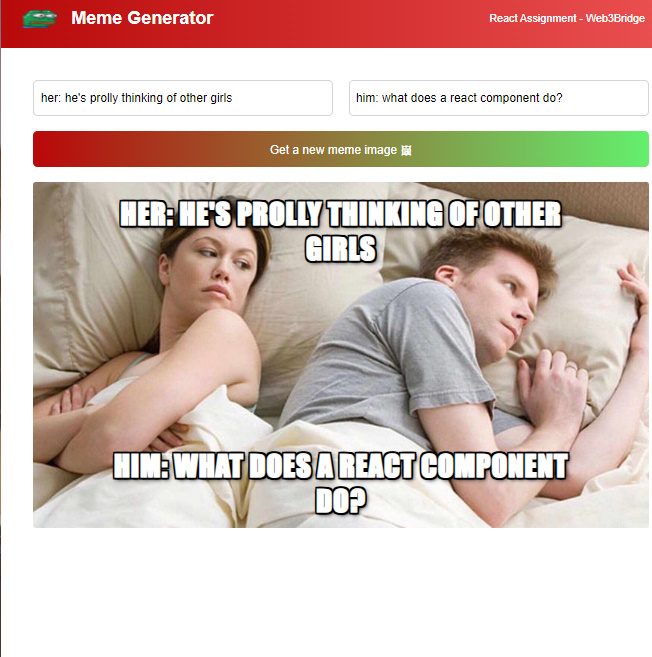

### Project: Meme Generator with React js

## Web3bridge React Assignment

## The challenge

Users should be able to:

- Add text to the top and bottom on images
- Select images randomly
- change their text

## Screenshot

## Links

- Live Site Url: ()

## Built with
- Vite React app
- Vanilla css
- React && Jsx

### What I learned
I learnt how to use hooks in react and general react structure.

## Author

- Twitter - [@Affiliate_Hima](https://www.twitter.com/Affiliate_Hima)